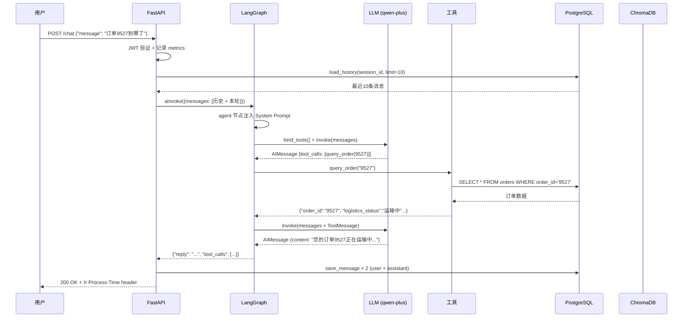

# 企业客服 Agent 面试 Q&A

> 基于本项目实际开发中遇到的问题和解决方案整理，所有答案均来源于真实踩坑经历。

---

## 一、项目概述

**项目名**：企业客服 Agent（LangGraph + RAG + FastAPI）

**一句话介绍**：一个手写 LangGraph 工作流的电商客服 Agent，能查订单、查知识库、建工单，支持多轮对话和 JWT 认证，测试覆盖率 50/50，AI 评测通过率 100%。

**技术栈**：Python · FastAPI · LangGraph · PostgreSQL · ChromaDB · JWT · Prometheus · Docker

**代码量**：约 2500 行 Python，50 个测试用例，23 个场景化评测用例

---

## 二、架构设计

### Q1：整体架构图是什么？

**技术栈分层视图：**

```mermaid
graph TB
    subgraph "客户端"
        U[用户 / 前端]
    end

    subgraph "API 层  main.py"
        MW[中间件：日志 + 指标 + request_id]
        AUTH[JWT Bearer 认证]
        CHAT[POST /chat]
        HEALTH[GET /health]
        METRICS[GET /metrics]
    end

    subgraph "Agent 层  agent.py"
        SG[LangGraph StateGraph<br/>手写 ReAct 循环]
        AGENT[agent 节点：LLM 思考<br/>bind_tools() + invoke()]
        TOOLS[ToolNode：工具分发]
        COND{有 tool_calls?}
    end

    subgraph "工具层  tools.py"
        QO[query_order<br/>查订单 + 物流]
        SK[search_knowledge<br/>RAG 向量检索]
        CT[create_ticket<br/>创建工单]
        CB[Circuit Breaker<br/>熔断器]
    end

    subgraph "存储层"
        PG[(PostgreSQL<br/>orders / tickets<br/>messages / users)]
        CHROMA[(ChromaDB<br/>knowledge_base<br/>chunk embeddings)]
    end

    subgraph "基础设施"
        DOCKER[Docker Compose<br/>多阶段构建 + healthcheck]
        PROM[Prometheus 指标<br/>http_requests<br/>tool_calls<br/>errors]
    end

    U -->|HTTP| CHAT
    CHAT --> MW
    MW --> AUTH
    AUTH -->|401| U
    AUTH -->|token OK| SG

    SG --> AGENT
    AGENT --> COND
    COND -->|是| TOOLS
    COND -->|否| RESULT[返回回复]
    TOOLS --> QO
    TOOLS --> SK
    TOOLS --> CT
    QO --> PG
    SK --> CB
    CB -->|熔断 OPEN| SK_FAIL[返回"知识库暂不可用"]
    CB -->|CLOSED| CHROMA
    CT --> PG

    AGENT -.-> PROM
    QO -.-> PROM
    CT -.-> PROM
    SK -.-> PROM

    style SG fill:#e1f5ff
    style CB fill:#fff3cd
    style PG fill:#d4edda
    style CHROMA fill:#f8d7da
```

**核心数据流（一次完整请求）：**



**回答要点（面试时说）：**

> 整个链路分四层：API 层负责认证和监控、Agent 层是手写的 ReAct 循环、工具层有三个工具分别接不同的数据源、存储层是 PostgreSQL 和 ChromaDB。
>
> 最关键的设计点是 **Agent 层**——没有用官方的 `create_react_agent`，而是自己定义了 StateGraph 的节点和边，这样状态流转完全可控，也能在面试时说清楚每一层在做什么。

---

### Q1b：面试时怎么用这张图？（实战话术）

面试官说"介绍一下你的项目"时，按这个节奏讲：

**第一层：一句话定位（10 秒）**
> "这是一个基于 LangGraph 的企业客服 Agent，核心能力是查订单、查知识库、建工单，支持多轮对话和 JWT 认证。"

**第二层：分层介绍（30 秒）**
> "整体分四层：
> - **API 层**：FastAPI 做请求入口，中间件负责日志和 Prometheus 指标，JWT 做认证
> - **Agent 层**：手写 LangGraph StateGraph 实现 ReAct 循环，这是项目的核心
> - **工具层**：三个工具分别接 PostgreSQL 和 ChromaDB，还有熔断器保护 embedding 接口
> - **存储层**：PostgreSQL 存订单和对话历史，ChromaDB 存知识库向量"

**第三层：挑一个亮点深入（1-2 分钟）**
> "我重点说一下 Agent 层为什么手写——官方的 create_react_agent 虽然方便，但状态流转是黑盒。我手写之后可以清楚解释 state 里有什么、每条边什么时候触发、循环怎么停下来。这也是面试必问的点，自己写过才讲得出来。"

**第四层：引出数据流（可选）**
> "一次请求的完整流程是：用户发消息 → 恢复历史 → 进 Agent 图 → LLM 决定是否调工具 → 工具执行 → 结果喂回 LLM → 直到不再调工具为止 → 返回回复 + 持久化历史。"
              ↓
         持久化对话历史 → PostgreSQL
              ↓
         返回回复 + 工具调用轨迹
```

**关键设计点**：
- **不用 `create_react_agent`**：官方封装一行代码能用，但面试时讲不清楚状态怎么流转。手写图结构才能说清楚"什么时候停、state 里存了什么"。
- **消息只存 user + assistant**：工具调用的中间过程（tool_calls / ToolMessage）不入库，恢复上下文时不需要那些实现细节。

---

### Q2：为什么手写 StateGraph，不用官方的 `create_react_agent`？

面试官问这个是想确认你不是只会调 API。

**回答要点**：

> `create_react_agent` 是官方封装，内部实现和我的手写版本逻辑完全一致——都是 ReAct 循环：模型思考 → 调工具 → 结果喂回模型 → 直到不再调工具为止。
>
> 但封装的好处是少写几行代码，坏处是面试官问"state 里有什么、图的边是怎么定义的"时，你说不出来。我选择手写是为了确保自己真正理解每一层的职责：
> - `AgentState` 定义 state schema（只有 messages 一个字段）
> - `call_model` 节点负责注入 system prompt、调 LLM
> - `ToolNode` 是官方提供的现成节点（这个没必要重写）
> - `add_conditional_edges` 用 `tools_condition` 判断是否还有 tool_calls
>
> 这样即使面试官追问细节，我能从 StateGraph 的定义一路讲到工具执行完回到 agent 节点的整个流程。

**面试加分项**：主动提"ToolNode 我用的是官方实现，因为它的逻辑就是读 AIMessage.tool_calls 然后 dispatch，自己重写没有额外价值"——体现你有判断力，不是为手写而手写。

---

### Q3：多轮对话的记忆是怎么实现的？

> 核心就是一个 `messages` 列表，存在 PostgreSQL 的 `messages` 表里。
>
> 每次请求进来时，先调 `load_history(session_id, limit=10)` 把最近 10 条历史取出来，拼成 HumanMessage / AIMessage 数组，再加上当前的用户消息，一起喂给 Agent 图。
>
> 返回后只存 user 消息和 assistant 最终回复，工具调用的中间过程（ToolMessage）不入库——它们是实现细节，恢复上下文时不需要。
>
> 滑动窗口用倒序查 LIMIT 再反转实现：正序查全量再切片会随会话变长越来越慢，倒序+LIMIT 让成本恒定。

**可以追问的细节**：
- limit 默认 10 条，在 config.py 里可配置
- session_id 由前端传，不传就生成一个 UUID
- 消息按 id 降序排列，保证最新在最前

---

## 三、RAG 与知识库

### Q4：RAG 的完整流程是什么？

> 分三步：建库（一次性）和检索（每次请求）。
>
> **建库流程**（`build_knowledge_base()`）：
> 1. 扫描 `knowledge/` 目录下所有 .md 文件，按文件名去重
> 2. 用自定义 `chunk_text()` 切分：先按段落合并，不超过 350 字开新 chunk，超长段落用滑动窗口兜底（步长 = chunk_size - overlap = 290）
> 3. 批量调用 embedding 接口向量化（每批 10 条，防止超限）
> 4. 写入 ChromaDB（cosine 相似度，持久化到本地 ./chroma_db）
>
> **检索流程**（`search()`）：
> 1. query 向量化（复用同样的 embedding 接口）
> 2. ChromaDB 查 top_k=3，返回 cosine distance
> 3. 过滤低于阈值的片段（threshold=0.25，即相似度 < 0.75 的直接丢弃，避免不相关的内容混进去）
> 4. 拼成带来源标注的文本，返回给 Agent
>
> **关键设计**：`search()` 永不抛异常。知识库为空、接口报错、无命中，都降级为一段明确文字，由 Agent 决定怎么回复，而不是整条链路 500。

---

### Q5：为什么不用 LangChain 的 DocumentLoader / TextSplitter / VectorStore？

> 这也是面试高频问题，考察你对框架的理解深度。
>
> 我的选择是：**底层组件自己写，上层编排用官方**。
>
> - `chunk_text()` 自己写：LangChain 的 CharacterTextSplitter 是按字符数硬切的，不考虑语义边界。我的实现先按空行/标题切成自然段，再贪心合并，语义完整性更好。
> - ChromaDB 直接用原生 API：LangChain 的 Chroma 封装没有提供 cosine 空间配置的入口，而且原生 API 更直接，不需要多绕一层。
> - embedding 自己调 HTTP 接口：因为要支持智谱、DeepSeek 等多个 OpenAI 兼容接口，统一走一个 POST /embeddings 的入口，换厂商只改 config.py 里的 base_url。
>
> 这样做的好处是每个环节的参数我都清楚为什么这么设，面试时被问到可以当场展开。

---

### Q6：Embedding 接口挂了怎么办？（熔断器）

> 这是 V7 新增的企业级特性，也是面试亮点。
>
> embedding 是整个链路最脆弱的外部依赖——既要发 HTTP，又要写 SQLite。一旦它开始抖动，盲目重试只会雪上加霜。
>
> 我实现了一个进程内熔断器（Circuit Breaker），状态机：
> ```
> CLOSED → (连续失败 N 次) → OPEN → (等待 M 秒) → HALF_OPEN → (探测成功) → CLOSED
>                                          ↓（探测失败）
>                                         OPEN（继续等）
> ```
>
> 默认配置：连续 3 次失败后短路 30 秒。OPEN 状态下直接返回错误文字，让 Agent 告诉用户"知识库暂时不可用"，而不是一直重试把压力打在故障服务上。
>
> **面试延伸**：生产环境应该用 Redis 做分布式熔断，当前是进程内单实例版本，为后续扩展留了接口。

---

## 四、数据库与异步架构

### Q7：为什么选 asyncpg 而不是 psycopg2？

> asyncpg 是 Pure Python 实现的异步 PostgreSQL 驱动，性能比 psycopg2 高 2-3 倍，而且是 SQLAlchemy 2.0 异步生态的首选驱动。
>
> psycopg2 是同步的，要配合 `psycopg2.pool` 或者放在线程池里用，会增加复杂度。asyncpg 原生支持 asyncio，和 FastAPI 的事件循环无缝衔接。
>
> **代价**是 Windows 下有一点小坑（见下面 Q11）。

---

### Q8：`ensure_tables()` 为什么设计成惰性建表？

> 这是为了服务可用性：import `db.py` 时不碰网络，`create_async_engine` 只创建引擎对象不建立连接。真正建表发生在第一次 DB 操作时（`ensure_tables()` 内部幂等，用 `_tables_lock` 保证只执行一次）。
>
> 好处是：即使 PostgreSQL 没启动，FastAPI 服务也能正常起来，错误推迟到工具调用那一刻以明确报错暴露，而不是启动时就崩。这对 Docker Compose 编排很重要——postgres 容器还没 ready 的时候，app 容器可以先启动。

---

### Q9：滑动窗口历史读取的 SQL 为什么用倒序 + LIMIT？

> 假设一个会话有 1000 条历史消息，limit=10：
> - 正序查全量再切片：扫描 1000 行，内存里存 1000 行，再取最后 10 行
> - 倒序查 LIMIT 10 再反转：扫描 10 行，内存里只存 10 行
>
> 随着会话变长，正序方案越来越慢，倒序方案成本恒定。这就是为什么用 `ORDER BY id DESC LIMIT 10` 再 `reversed()`。

---

## 五、工程化与运维

### Q10：Prometheus 指标有哪些？为什么这么设计？

> 暴露了 4 类指标：
> - `http_requests_total`：请求总数，按 method/path/status 分桶 → 画 QPS 曲线和错误率
> - `http_request_duration_seconds`：耗时直方图，buckets 覆盖 100ms~10s → 算 P50/P95/P99
> - `agent_tool_calls_total`：工具调用次数，按工具名和结果分桶 → 监控哪个工具最容易失败
> - `agent_errors_total`：Agent 层错误，按错误类型分桶
>
> **设计原则**：所有 Counter/Histogram 在模块加载时创建一次，全局复用。不这样做会在高 QPS 下 OOM——每个请求都 new 一个 Counter 会导致 label cardinality 爆炸。

---

### Q11：Windows 上 asyncpg 的坑是什么？怎么解决的？

> Windows 用 ProactorEventLoop，事件循环关闭时清理 socket 连接会报 `AttributeError: 'NoneType' object has no attribute 'send'` 或 `another operation is in progress`。
>
> 这个问题只影响测试 teardown（dispose 引擎时），不影响业务逻辑。我用了两个策略：
> 1. 测试用 `NullPool`（每个测试独立连接，不用连接池），减少连接复用时的事件循环冲突
> 2. dispose 时加 try/except 静默处理，因为进程退出时事件循环已经关闭，强 dispose 没有意义
>
> **生产环境不会有问题**，因为服务进程一直存活，事件循环不会关闭。

---

### Q12：JWT 双令牌设计是什么？为什么不用单令牌？

> access token（15 分钟短命）+ refresh token（7 天长命）。
>
> 短命 access token 降低泄露风险——即使被截获，有效期也很短。长命 refresh token 减少登录摩擦——用户不用每 15 分钟重新登录。
>
> 刷新流程：用 refresh token 调 `/api/auth/refresh`，后端验证后签发新的 access + refresh 对。注销时把 access token 加入内存黑名单（生产环境应替换为 Redis）。
>
> **面试延伸**：如果要做多实例部署，黑名单需要换成 Redis，接口不变，只是底层存储换一下。

---

## 六、踩过的坑（最有价值的部分）

### Q13：passlib + bcrypt 5.0 兼容性问题怎么解决的？

> **现象**：`hash_password()` 直接抛 `ValueError: password cannot be longer than 72 bytes`，连测试都跑不通。
>
> **根因**：passlib 1.7.4 初始化 bcrypt backend 时会跑一组兼容性检测，其中有一个测试用例用了 255 字节的密码（用于检测 bcrypt 的 wraparound bug）。bcrypt 5.0 把这个长度限制当作 error 而不是 warning，直接抛异常。
>
> **修复**：去掉 passlib，直接用 bcrypt 原生 API：
> ```python
> def hash_password(password: str) -> str:
>     salt = bcrypt.gensalt(rounds=12)
>     return bcrypt.hashpw(password.encode(), salt).decode()
>
> def verify_password(plain, hashed):
>     return bcrypt.checkpw(plain.encode(), hashed.encode())
> ```
> 代码更简洁，也不再有 passlib 的版本耦合问题。

---

### Q14：测试里 DB 连接一直跳过，后来怎么修好的？

> **第一层问题**：`_skip_if_no_db()` 用了 `db.engine.execute()`，但 SQLAlchemy 2.0 的 `AsyncEngine` 没有 `.execute()` 方法，必须用 `async with engine.connect() as conn: await conn.execute()`。这个 bug 导致即使 DB 可用也永远返回 False，所有集成测试都被跳过。
>
> **第二层问题**：修了检测逻辑后发现测试 FAIL 而不是 SKIP——因为 `db_session` fixture 创建的 session 用的是新引擎，但 `db.create_user()` 等函数内部仍然引用原始的 `db.AsyncSessionLocal`（指向生产库）。需要在 fixture 里同时 patch `db.engine` 和 `db.AsyncSessionLocal`。
>
> **第三层问题**：Windows teardown 时报连接错误，用 `NullPool` + try/except 解决。

---

### Q15：LLM 评测通过率从 74% 升到 100%，改了哪些 Prompt？

> 失败了 6 个用例，根因两类：
>
> **第一类：模型不按规则调工具（4 个）**
> - `tool_select_006/rag_002/rag_004`：发票/退货/7天问题，模型直接用训练知识回答了，没调 search_knowledge
> - 修复：在 system prompt 开头加了一条铁律——"严禁在无工具输入的情况下凭记忆回答任何政策类问题"，并列举了触发关键词（退货、发票、7天、48小时等）
>
> **第二类：模型自作主张建工单（1 个）**
> - `tool_select_005`：用户问物流，模型查到异常后自动建了工单
> - 修复：加了错误示范和正确示范的对比，明确"查物流 ≠ 建单"
>
> **第三类：多轮对话丢失上下文（1 个）**
> - `memory_004`：第一轮说了订单 67890，第二轮"它的快递到哪了"，模型直接用训练数据回答了，没调 query_order
> - 修复：强化了 prompt——"严禁凭记忆或训练数据中的旧信息直接回答，必须调 query_order 获取实时数据"

---

## 七、项目亮点总结（简历用）

| 亮点 | 一句话说明 |
|------|-----------|
| 手写 LangGraph | 不用 create_react_agent，自己定义节点和边，能说清楚状态流转 |
| Circuit Breaker | Embedding API 连续失败 3 次后短路 30 秒，防雪崩 |
| 异步架构 | asyncpg + NullPool，工具调用走线程池，事件循环零阻塞 |
| 全链路 RAG | 从文档加载到向量检索，每步参数都有设计理由 |
| 生产级工程 | JWT 认证、结构化日志、Prometheus 指标、Docker 部署 |
| 测试覆盖 | 50 个用例全通过，23 个场景化评测 100% 通过 |

---

## 八、可能被追问的深挖问题

1. **为什么用 cosine 而不是 l2？**
   cosine 只关心向量方向（语义相似度），不关心模长。文本 embedding 的模长没有语义含义，用 cosine 更标准。

2. **chunk_size 为什么设 350？**
   中文政策类文本一屏在 200-400 字，350 是经验值。太大则一段混了多个主题，语义被稀释；太小则上下文不完整。实际跑下来大多数文档只产出 1 个 chunk。

3. **similarity_threshold 为什么设 0.25？**
   ChromaDB 用 cosine distance，范围是 [0, 2]，0 表示完全相同。threshold=0.25 意味着相似度 > 0.75 才召回，是保守值，防止乱问的问题也能命中垃圾片段。

4. **为什么不把工具调用轨迹存数据库？**
   工具调用是执行过程，不是对话内容。恢复上下文时只需要 user 和 assistant 的消息，ToolMessage 是中间产物，存了既浪费空间又干扰模型理解。

5. **如果要做成多租户 SaaS，需要改哪里？**
   - JWT 黑名单换成 Redis
   - ChromaDB 按 tenant_id 分集合
   - PostgreSQL 加 tenant_id 字段做行级隔离
   - 熔断器换成分布式（Redis 原子计数）
